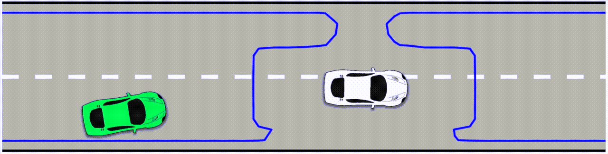

# SHARP: Shielding-Aware Robust Planning
<!-- Implementation of SHARP: Shielding-Aware Robust Planning for Safe and Efficient Human-Robot Interaction -->

[![License][license-shield]][license-url]
[![Homepage][homepage-shield]][homepage-url]


<!-- PROJECT LOGO -->
<br />
<p align="center">
  <a href="https://github.com/SafeRoboticsLab/SHARP">
    
  </a>

  <h3 align="center">SHARP</h3>

  <p align="center">
    SHARP: Shielding-Aware Robust Planning for Safe and Efficient Human-Robot Interaction
    <!--
    <br />
    <a href="https://github.com/SafeRoboticsLab/SHARP"><strong>Explore the docs »</strong></a>
    <br />
    <br />
    <a href="https://github.com/SafeRoboticsLab/SHARP">View Demo</a>
    ·
    <a href="https://github.com/SafeRoboticsLab/SHARP/issues">Report Bug</a>
    ·
    <a href="https://github.com/SafeRoboticsLab/SHARP/issues">Request Feature</a>
    -->
  </p>
</p>


<!-- TABLE OF CONTENTS -->
<details open="open">
  <summary><h2 style="display: inline-block">Table of Contents</h2></summary>
  <ol>
    <li><a href="#about-the-project">About The Project</a></li>
    <li><a href="#dependencies">Dependencies</a></li>
    <li><a href="#example">Example</a></li>
    <li><a href="#dataset">Dataset</a></li>
    <li><a href="#license">License</a></li>
    <li><a href="#contact">Contact</a></li>
    <li><a href="#acknowledgements">Acknowledgements</a></li>
  </ol>
</details>


<!-- ABOUT THE PROJECT -->
## About The Project

SHARP: Shielding-Aware Robust Planning is a general framework for safe and efficient human-robot interaction (HRI). We provide a MATLAB implementation of SHARP for autonomous driving scenarios, which can be found [here](https://github.com/SafeRoboticsLab/SHARP/tree/main/MATLAB).

The Python implementation is being actively developed. Stay tuned!


## Dependencies

#### Control, Planning and Optimization
* [`MPT3`](https://www.mpt3.org/) (Toolbox for MPC and parametric optimization)
* [`MOSEK`](https://www.mosek.com/) (Quadratic programming solver. Alternatively, you may consider MATLAB's default `quadprog`.)

#### Shielding
* [`Level Set Toolbox`](https://www.cs.ubc.ca/~mitchell/ToolboxLS/) (Toolbox for solving HJ PDE)
* [`helperOC`](https://github.com/HJReachability/helperOC) (Toolbox for HJ-based shielding)

#### Visualization
* [`Robotics Toolbox for MATLAB`](https://petercorke.com/toolboxes/robotics-toolbox/) (Tools for plotting the vehicles. You need to first install it in MATLAB and then replace `plot_vehicle.m` in the root directory with [ours](https://github.com/SafeRoboticsLab/SHARP/blob/main/MATLAB/ThirdParty/Robotics%20Toolbox%20for%20MATLAB/plot_vehicle.m).)

## Example
In this repository, we provide an example of SHARP applied for human-robot interactive driving scenarios.

1. Clone the repo
   ```sh
   git clone https://github.com/SafeRoboticsLab/SHARP.git
   ```
2. In MATLAB, run the [`main.m`](https://github.com/SafeRoboticsLab/SHARP/blob/main/MATLAB/main.m) script to reproduce our results.
3. (Optional) You may change the problem specifications and planner parameters in [here](https://github.com/SafeRoboticsLab/SHARP/blob/main/MATLAB/util/initializePlanner.m).

## Dataset
We use the human driver's trajectories from the [Waymo Open Motion Dataset](https://waymo.com/open/data/motion/). In particular, we filtered out 50 representative highway overtaking scenarios from the [original dataset](https://waymo.com/open/data/motion/). Raw data with filtered trajectories can be found [here](https://github.com/SafeRoboticsLab/SHARP/tree/main/MATLAB/data/waymo_motion_dataset/filtered_raw_data). Filtered trajectories in MATLAB's cell format can be found [here](https://github.com/SafeRoboticsLab/SHARP/tree/main/MATLAB/data).


<!-- USAGE EXAMPLES 
## Usage

Use this space to show useful examples of how a project can be used. Additional screenshots, code examples and demos work well in this space. You may also link to more resources.

_For more examples, please refer to the [Documentation](https://example.com)_
-->


<!-- ROADMAP 
## Roadmap

See the [open issues](https://github.com/SafeRoboticsLab/SHARP/issues) for a list of proposed features (and known issues).
-->


<!-- CONTRIBUTING 
## Contributing

Contributions are what make the open source community such an amazing place to learn, inspire, and create. Any contributions you make are **greatly appreciated**.

1. Fork the Project
2. Create your Feature Branch (`git checkout -b feature/AmazingFeature`)
3. Commit your Changes (`git commit -m 'Add some AmazingFeature'`)
4. Push to the Branch (`git push origin feature/AmazingFeature`)
5. Open a Pull Request
-->


<!-- LICENSE -->
## License

Distributed under the BSD 3-Clause License. See `LICENSE` for more information.


<!-- CONTACT -->
## Contact

Haimin Hu - [@HaiminHu](https://twitter.com/HaiminHu) - haiminh@princeton.edu

Project Link: [https://github.com/SafeRoboticsLab/SHARP](https://github.com/SafeRoboticsLab/SHARP)

Homepage Link: [https://haiminhu.org/research/sharp](https://haiminhu.org/research/sharp)


<!-- ACKNOWLEDGEMENTS -->
## Acknowledgements

* This research is supported by the [Princeton Project X](https://aspire-report.princeton.edu/engineering/project-x-fund) Program.
* We use the human driver's trajectories from the [Waymo Open Motion Dataset](https://waymo.com/open/data/motion/).


<!-- MARKDOWN LINKS & IMAGES -->
<!-- https://www.markdownguide.org/basic-syntax/#reference-style-links -->
[contributors-shield]: https://img.shields.io/github/contributors/SafeRoboticsLab/repo.svg?style=for-the-badge
[contributors-url]: https://github.com/SafeRoboticsLab/SHARP/contributors
[forks-shield]: https://img.shields.io/github/forks/SafeRoboticsLab/repo.svg?style=for-the-badge
[forks-url]: https://github.com/SafeRoboticsLab/SHARP/network/members
[stars-shield]: https://img.shields.io/github/stars/SafeRoboticsLab/repo.svg?style=for-the-badge
[stars-url]: https://github.com/SafeRoboticsLab/SHARP/stargazers
[issues-shield]: https://img.shields.io/github/issues/SafeRoboticsLab/repo.svg?style=for-the-badge
[issues-url]: https://github.com/SafeRoboticsLab/SHARP/issues
[license-shield]: https://img.shields.io/badge/License-BSD%203--Clause-blue.svg
[license-url]: https://opensource.org/licenses/BSD-3-Clause
[linkedin-shield]: https://img.shields.io/badge/-LinkedIn-black.svg?style=for-the-badge&logo=linkedin&colorB=555
[linkedin-url]: https://linkedin.com/in/SafeRoboticsLab
[homepage-shield]: https://img.shields.io/badge/-Homepage-brightgreen
[homepage-url]: https://haiminhu.org/research/sharp
